# Incubyte_assignment
Incubate Assessment - String calculator 

we will do the assignment in the following steps:

# Step 1: Given a String s , it contains two number comma separater return the sum of the numbers
 For the given test case base cases can be 
 1. if the string is empty return 0;
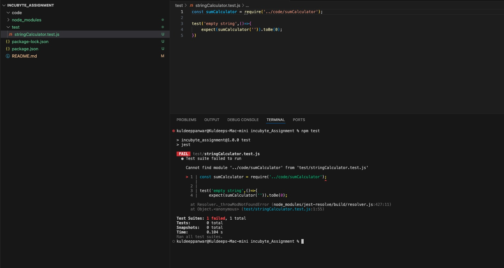
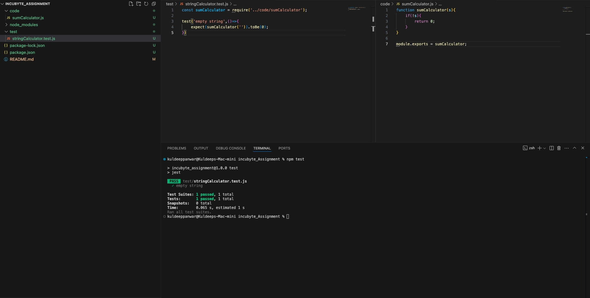
 2. if the string contains only one number return that number;

 3. if the string contains two numbers return the sum of the two numbers;
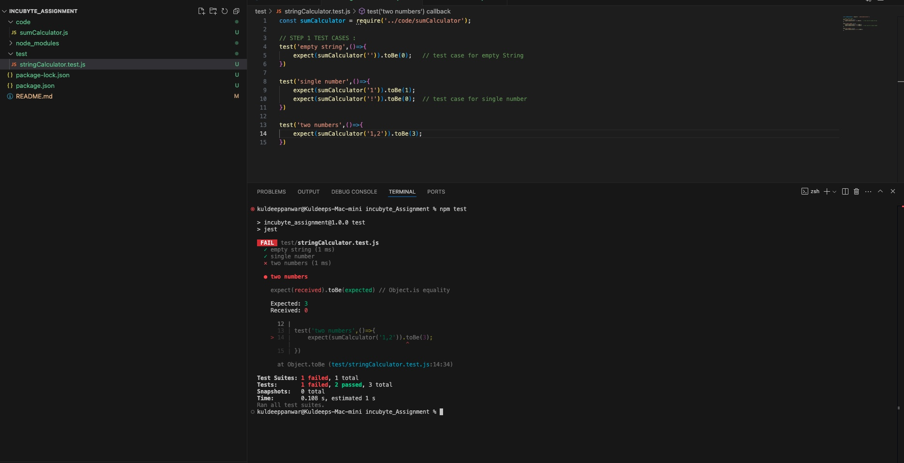
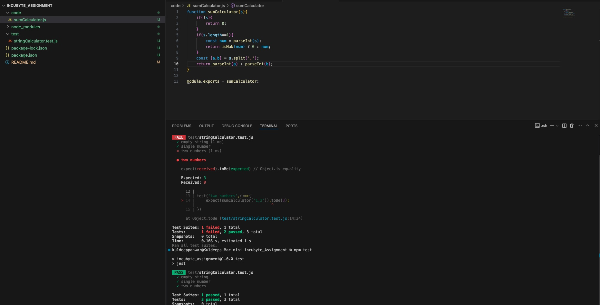
 4. Last code refactor for Step1 
 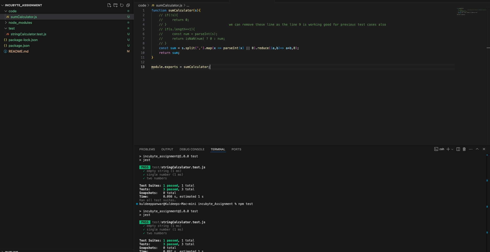
 # Step 2:  Given String s contains any amount of number comma separated
 no chnages in code function as all the test cases passed with the last refactor of Step1
 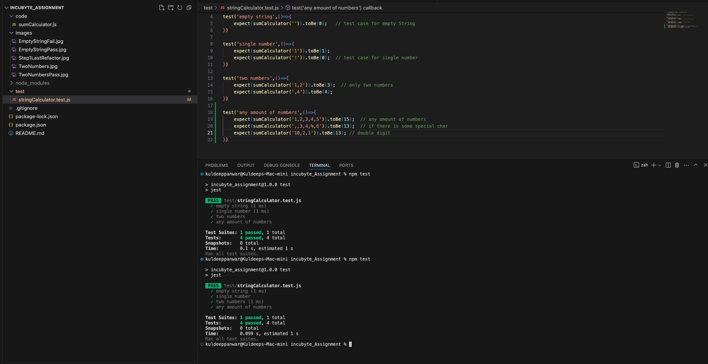

 # Step 3: Given String s contains any amount of number but  each place can have \n
 Support new line character \n

 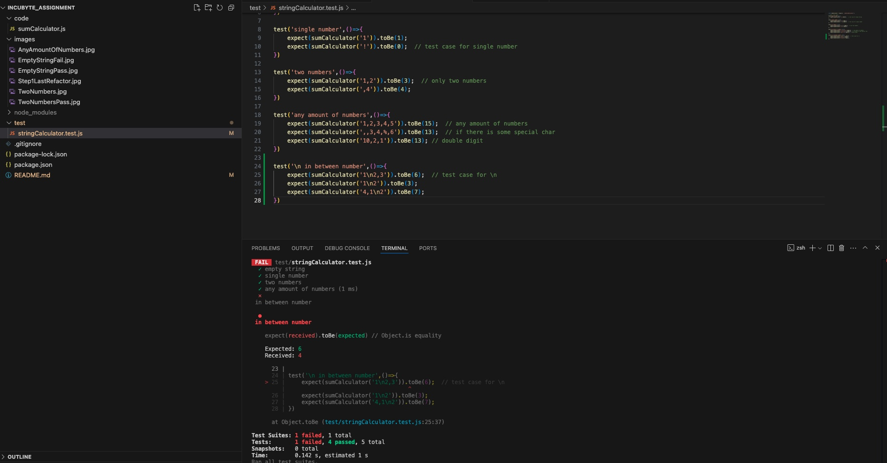
 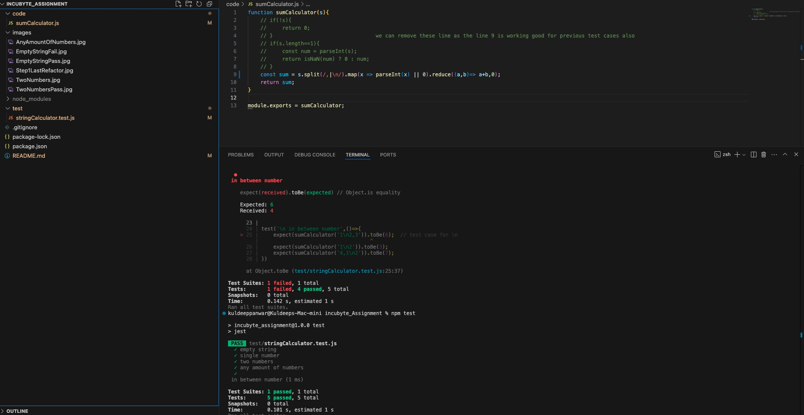
# Step 4 : Given String s ,return sum that split on the basis of different delimeter

Approach we know we have the string like this "//[delimeter]\n[numbers]" 
just get the delimeter and add it to the regular expression to split the string.
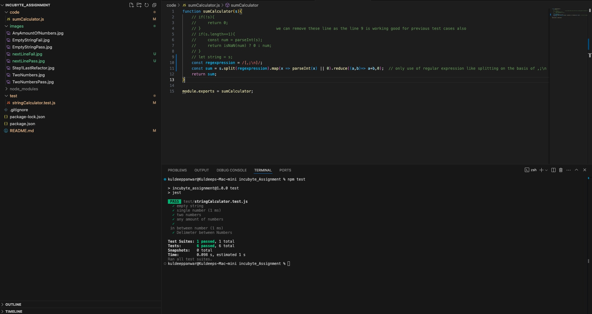
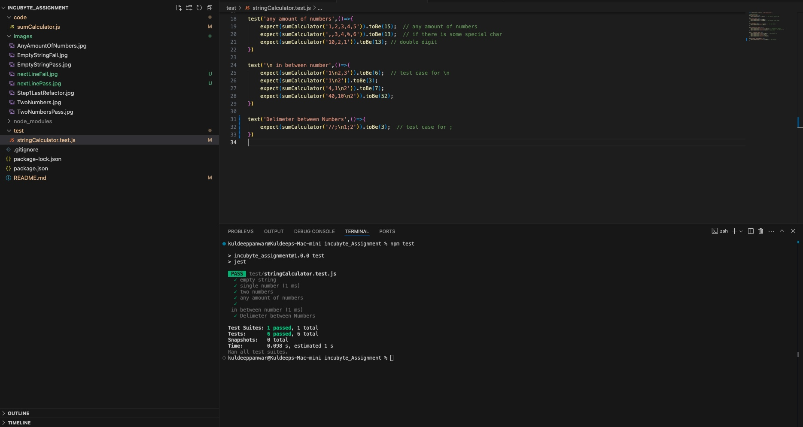
now its work with regexpression varibale 

now to support different delimeters we dynamically take the delimeter and add to regexpression variable
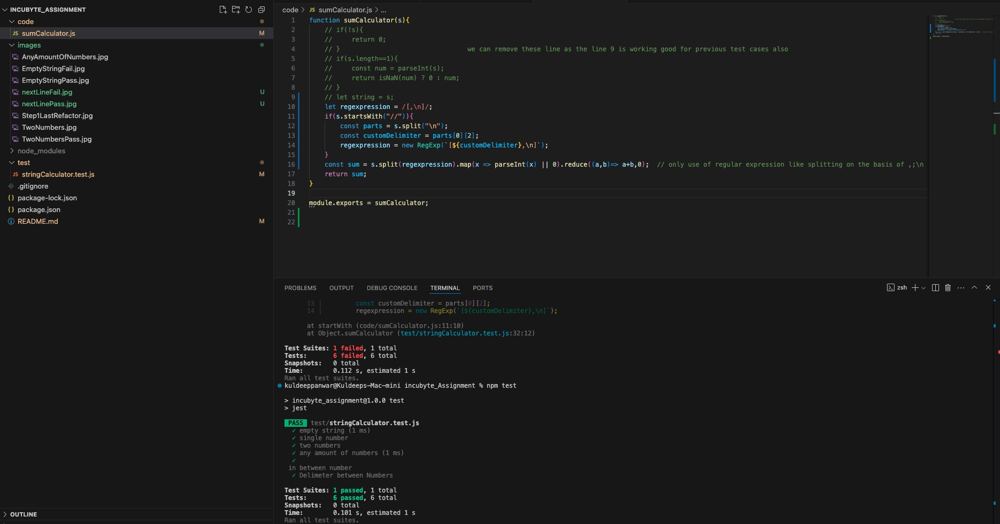
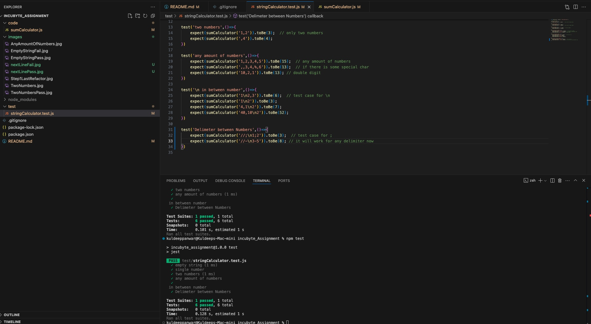

# Step 5 : Throw Error if a -ve number is present in the string
Test Case fails
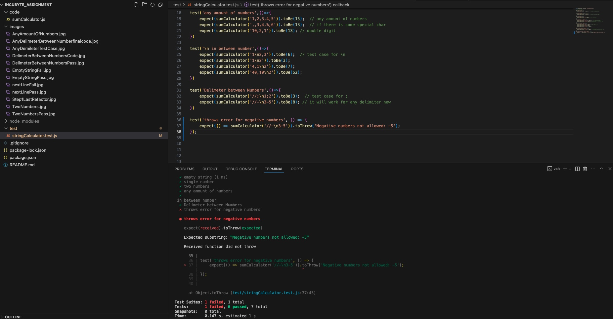
Test Case Passes
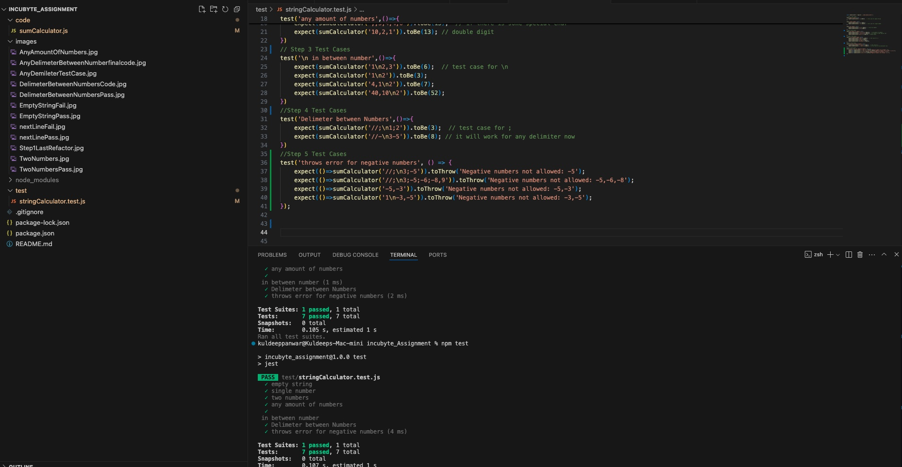